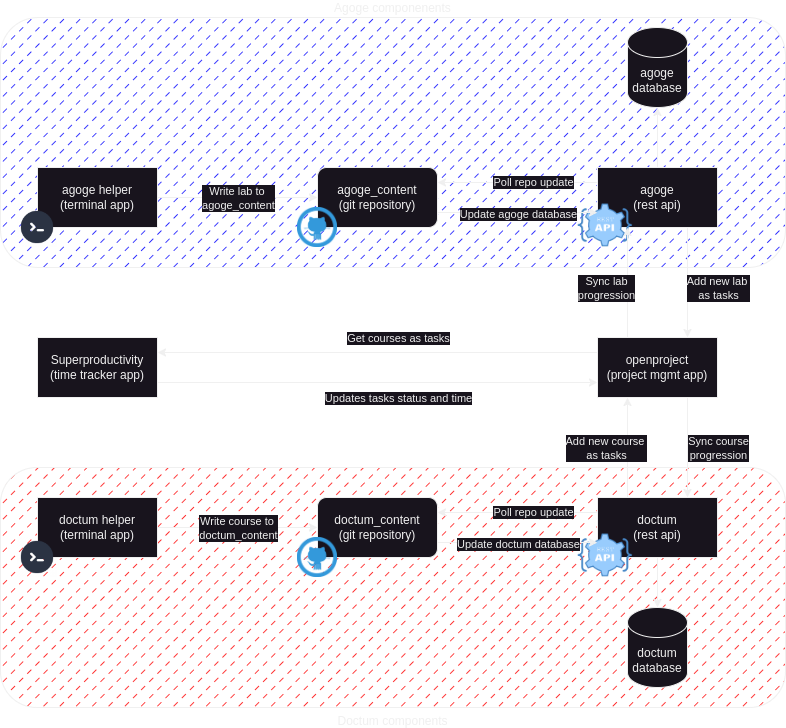

#  Tenjinsama 

## Description 

Welcome to Tenjinsama organization, regrouping projects about improving learning and training in IT.  
It includes tools like task management, time tracker, terminal tools in order to create and work on IT courses (theorical) and labs (pratical)

Look at the drawio schema for a better description of this project :  
 

### Projects components :

- Doctum :
    - [doctum_helper](https://github.com/tenjinsama/doctum_helper) : A simple terminal application to create course
    - [srv-doctum](https://github.com/tenjinsama/srv-doctum) : A rest API that sync course with openproject
    - [doctum_content](https://github.com/tenjinsama/doctum_content) : A repository that store all courses generated by doctum_helper

- Agoge :
    - [agoge_helper](https://github.com/tenjinsama/agoge_helper) : A simple terminal application to create labs scenario
    - [srv(agoge](https://github.com/tenjinsama/srv-agoge) : A rest API that sync labs with openproject
    - [agoge_content](https://github.com/tenjinsama/agoge_content) : A repository that store all labs generated by agoge_helper