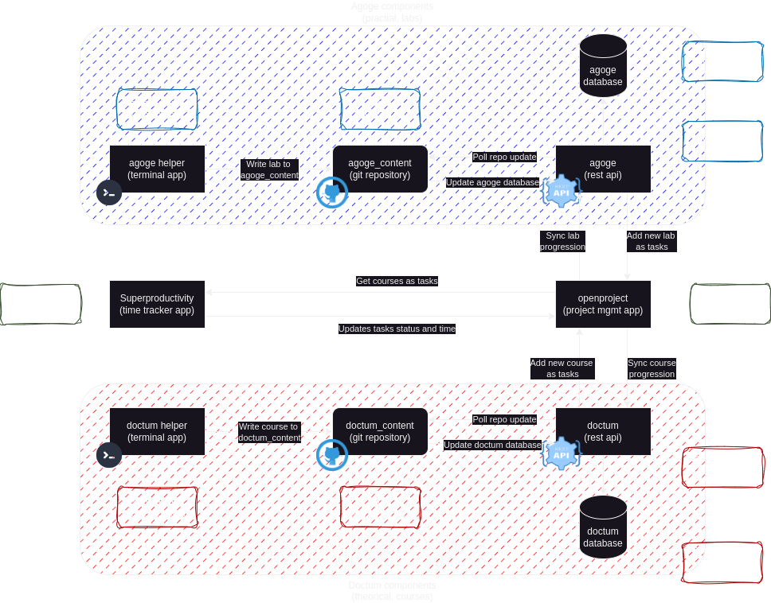

#  Tenjinsama 

## Description

Welcome to Tenjinsama organization, regrouping projects about improving learning and training in IT.  
It includes tools like task management, time tracker, terminal tools in order to create and work on IT courses (theorical) and labs (pratical).

This project is sperated in 3 logical entities :
- **Doctum** : Element related to learning theorically (courses : knowledge, concept and definition).
- **Agoge** : Element related to training practically (labs : skills, how to make things works).
- **Agone** : Element related to validating skills (exam : challenge, testing skills).

Look at the drawio schema for a better description of this project and it's components :  
 

### Projects components :

- **Doctum** :
    - [doctum_helper](https://github.com/tenjinsama/doctum_helper) : A simple terminal application to create course.
    - [srv-doctum](https://github.com/tenjinsama/srv-doctum) : A rest API that sync course with openproject.
    - [doctum_content](https://github.com/tenjinsama/doctum_content) : A repository that store all courses generated by doctum_helper (course sources).

- **Agoge** :
    - [agoge_helper](https://github.com/tenjinsama/agoge_helper) : A simple terminal application to create labs scenario.
    - [srv-agoge](https://github.com/tenjinsama/srv-agoge) : A rest API that sync labs with openproject.
    - [agoge_content](https://github.com/tenjinsama/agoge_content) : A repository that store all labs generated by agoge_helper (labs sources).

- **Agone** :
    - Work in progress ...

## Usage

> Note : You can use any components as you will, there is no requirements between them (you can use Doctum without Agoge).  
It's a personnal preferences to separate theorical learning/Course (doctum) from practical learning/Labs (agoge) but you can also use one for both usage.  
The procedure below assume that you would install and configure all components, skip parts that you don't need.

### Open project configuration

  
Configure Openproject with 2 new projects 

- Doctum
- Agoge

### Doctum configuration

  
Create your doctum_content git repository 

- create a new git repository for your doctum content, the name doesn't matter but it need to contain a main folder named `content`
- See repository example at [doctum_content](https://github.com/tenjinsama/doctum_content)

  
Install srv-doctum 

@TODO

  
Configure openproject and srv-doctum integration (token, address, ...)  

@TODO

### Agoge configuration

  
Create your agoge_content git repository 

- create a new git repository for your agoge content, the name doesn't matter but it need to contain a main folder named `content`
- See repository example at [agoge_content](https://github.com/tenjinsama/agoge_content)

  
Install srv-agoge 

@TODO

  
Configure openproject and srv-agoge integration (token, address, ...) 

@TODO

### Superproducivity configuration

  
Use Superproductivity to manage time and status tracking 

- Installation of Superproductivity is out of this project scope but find all data at [super-productivity project homepage](https://github.com/johannesjo/super-productivity)
- See related documentation for integration with openproject using documentation at [superproducivity Q&A](https://github.com/johannesjo/super-productivity/discussions/3861)

