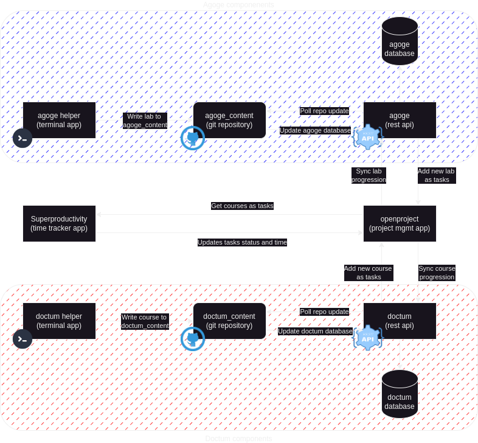

# Tenjinsama

## Description 

Welcome to Tenjinsama organization : a project about improving learning and training in IT.

Look at the drawio schema for a better description of this project :  

### Projects components :

- Doctum :
    - [doctum_helper]() : A simple terminal application to create course
    - [doctum]() : A rest API that sync course with openproject
    - [doctum_content]() : A repository that store all courses generated by doctum_helper

- Agoge :
    - [agoge_helper]() : A simple terminal application to create labs scenario
    - [agoge]() : A rest API that sync labs with openproject
    - [agoge_content]() : A repository that store all labs generated by agoge_helper